# Cоздание личного репозитория с нужным .gitignore и простым README.MD
- ## Создание личного репозитория:
    __Шаг__ __1.__ Зайдите в свой аккаунт на GitLab и нажмите на иконку "Groups" в верхней панели.
    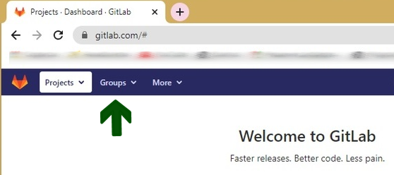
    __Шаг__ __2.__ Затем перейдите во вкладку "Your group".
    __Шаг__ __3.__ Выберите команду с названием вашего учебного проекта.
    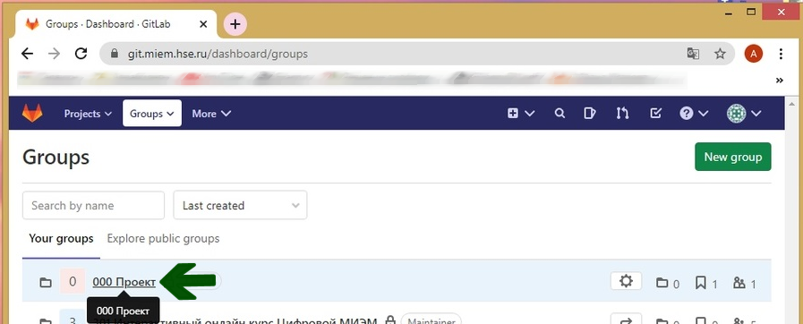
    __Шаг__ __4.__ Вы перешли на страницу своей команды. Теперь нужно создать репозиторий. Для этого нажмите на кнопку "New project".
    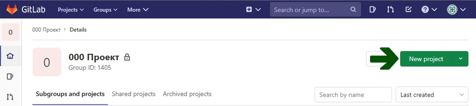
    __Шаг__ __5.__ Напишите название вашего репозитория и добавьте нужные данные. Готово!
    
- ## Добавление файла .gitignore:
    __Шаг__ __1.__ Открыть терминал
    __Шаг__ __2.__ Перейти к расположению репозитория GIT.
    __Шаг__ __3.__ Создайте файл .gitignore для репозитория.
    ```
    touch .gitignore
    ```
    Если команда будет выполнена успешно, она не выведет никаких данных.
    __Шаг__ __4.__ Далее сделайте:
    ```
    git add .gitignore
    git commit -m "текс_коммита"
    git push
    ```
- ## Добавление файла README.MD:
    __Шаг__ __1.__ Открыть терминал
    __Шаг__ __2.__ Перейти к расположению репозитория GIT.
    __Шаг__ __3.__ Создайте файл README.MD для репозитория.
    ```
    touch README.MD
    ```
    Если команда будет выполнена успешно, она не выведет никаких данных.
    __Шаг__ __4.__ Далее сделайте:
    ```
    git add README.MD
    git commit -m "текс_коммита"
    git push
    ```
    В ваш репозиторий будет добавлен путой файл README.MD
___
# Создание веток develop и master
Ветка master создается автоматически при создании git репозитория. Это ветка используется по умолчанию.
Чтобы создать ветку develop и сразу переключиться на неё мы можем использовать команду:
```
git checkout -b develop
```
Если требуется просто создать ветку и не переключаться на неё можно использовать команду:
```
git branch -b develop
```
___
# Установка ветки develop по умолчанию
__1.__ На GitHub.com перейдите на главную страницу репозитория.
__2.__ Под именем репозитория щелкните "Параметры". Если вкладка "Параметры" не отображается, выберите раскрывающееся меню  и нажмите кнопку "Параметры".
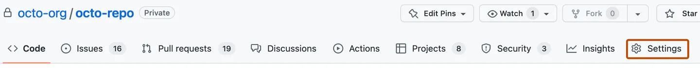
__3.__ В разделе "Ветвь по умолчанию" справа от имени ветвь по умолчанию щелкните ⇆.
__4.__ Выберите раскрывающееся меню ветвь и щелкните имя ветви.
__5.__ Нажмите кнопку Обновить.
__6.__ Прочтите предупреждение, а затем щелкните Я понимаю, обновите ветвь по умолчанию.
___
# Создание issue на создание текущего мануала
__1.__ На GitHub.com перейдите на главную страницу репозитория.
__2.__ Под именем репозитория щелкните _issue_.

__3.__ Щелкните _Новая проблема_.

__4.__ Если в репозитории используются шаблоны проблем, рядом с типом проблемы, которую вы хотите открыть, нажмите кнопку _Начало работы_.
Если тип проблемы, который вы хотите открыть, не включен в доступные параметры, нажмите кнопку _Открыть пустую проблему_.
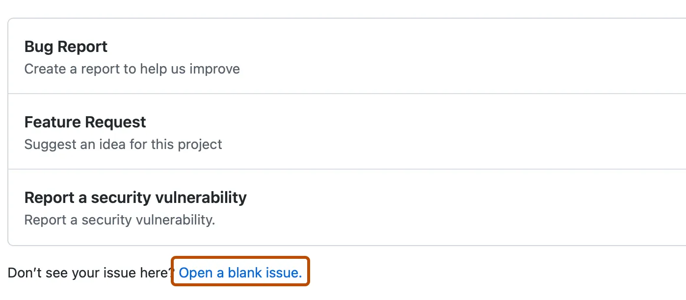
__5.__ В поле "Название" введите название проблемы.
__6.__ В поле текста комментария введите описание проблемы.
__7.__ Если вы являетесь координатором проекта, вы можете [назначить проблему другому пользователю](https://docs.github.com/ru/issues/tracking-your-work-with-issues/assigning-issues-and-pull-requests-to-other-github-users), [добавить ее на панель проекта](https://docs.github.com/ru/issues/organizing-your-work-with-project-boards/tracking-work-with-project-boards/adding-issues-and-pull-requests-to-a-project-board#adding-issues-and-pull-requests-to-a-project-board-from-the-sidebar), [связать ее с вехой](https://docs.github.com/ru/issues/using-labels-and-milestones-to-track-work/associating-milestones-with-issues-and-pull-requests) или [применить метку](https://docs.github.com/ru/issues/using-labels-and-milestones-to-track-work/managing-labels).
__8.__ Закончив, нажмите кнопку _Отправить новую проблему_.
___
# Создание ветки по issue
Любой пользователь с разрешением на запись в репозиторий может создать ветвь для проблемы. Для проблемы можно связать несколько ветвей.
По умолчанию новая ветвь создается в текущем репозитории и из ветви по умолчанию.
__1.__ На GitHub.com перейдите на главную страницу репозитория.
__2.__ Под именем репозитория щелкните _"Проблемы"_.
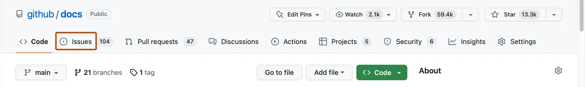
__3.__ В списке проблем щелкните проблему, для которой нужно создать ветвь.
__4.__ На правой боковой панели в разделе "Разработка" нажмите кнопку _Создать ветвь_. Если у проблемы уже есть связанная ветвь или запрос на вытягивание, выберите ⚙ и щелкните _Создать ветвь_.
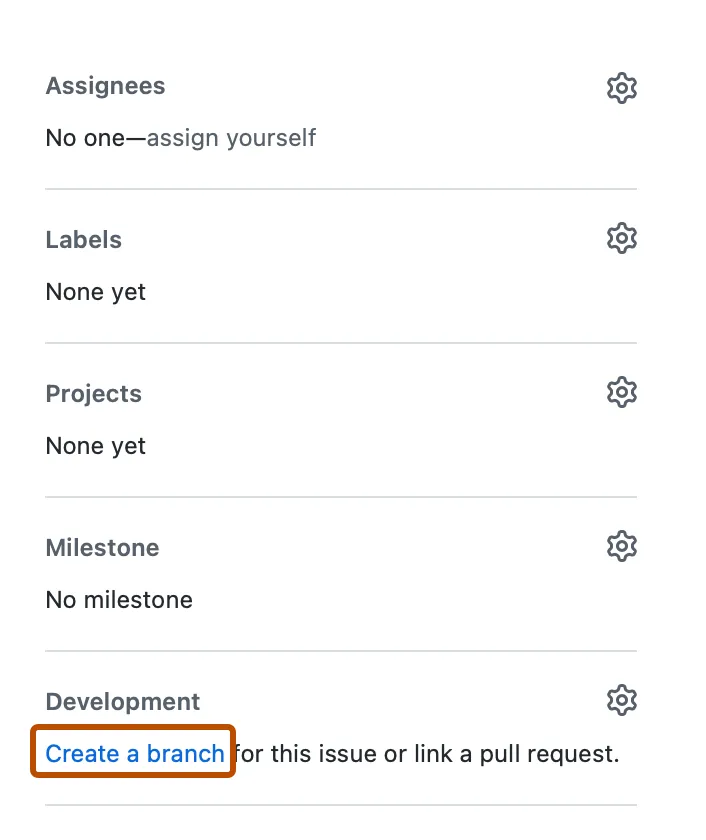
__5.__ При необходимости в поле "Имя ветви" введите имя ветви.
__6.__ При необходимости выберите раскрывающееся меню _Назначение репозитория_, а затем выберите репозиторий.
__7.__ В разделе "Дальнейшие действия" выберите, хотите ли вы работать с ветвью локально или открыть ветвь в GitHub Desktop.
__8.__ Щелкните _Создать ветвь_.
___
# Создание merge request по ветке в develop
Если после _git push_ консоль была закрыта, или же push был сделан через какое-либо приложение, то нужно зайти в свой GitLab, выбрать нужный проект, перейти на вкладку _Merge Requests_ и в правом верхнем углу нажать на зеленую кнопку _New Merge Request_.
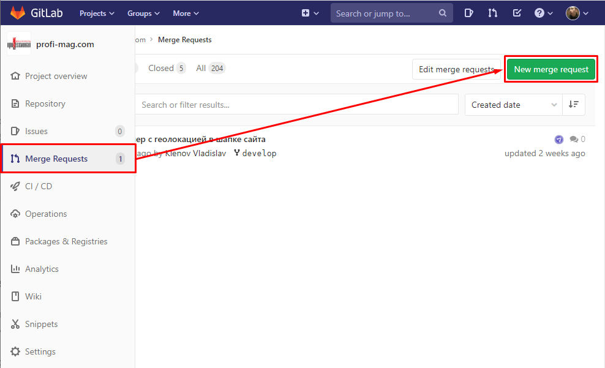
На следующей странице необходимо будет выбрать исходную ветку (вашу, слева), целевую векту, в которую будут вливаться изменения (справа) и нажать на кнопку "Compare branches and continue". В нашем случае изменения должны вливаться в ветку develop (справа выбираем develop).
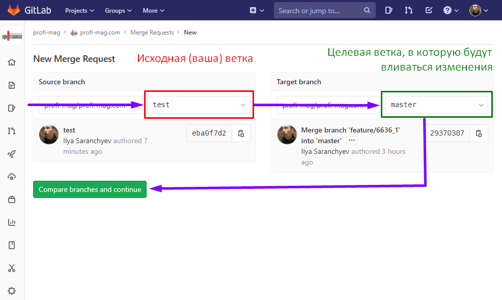
Более подробно можно посмотреть процесс оформления MR-a [регламенте](https://docs.stmd.pro/developers-reglament/merge-requests).
___
# Комментирование и принятие реквеста
## Рассмотрим пример описывающий данный вопрос:
В данном примере Мэри — разработчик, а Джон — человек, занимающийся поддержкой проекта. У обоих есть собственные публичные репозитории Bitbucket, и в репозитории Джона находится официальный проект.
### Мэри создает форк официального проекта

Чтобы начать работу над проектом, Мэри сначала должна создать форк репозитория Джона в Bitbucket. Для этого ей нужно войти в Bitbucket, перейти к репозиторию Джона и нажать кнопку Fork.
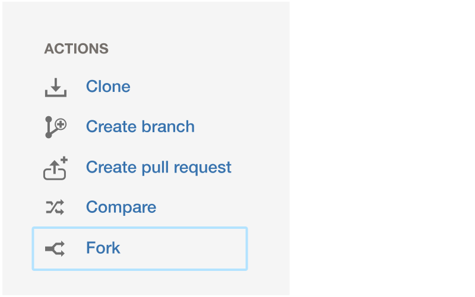
Указав имя и описание для репозитория, создаваемого с помощью форка, она получит копию серверной части проекта.
### Мэри клонирует свой репозиторий __Bitbucket__
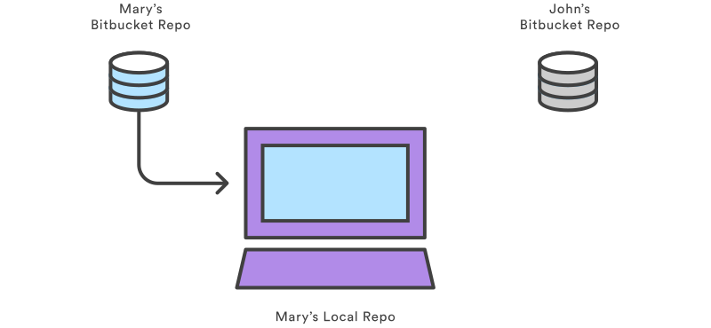
Затем Мэри должна клонировать репозиторий Bitbucket, который она только что создала с помощью форка. Так она получит собственную рабочую копию проекта на своей локальной машине. Она может сделать это с помощью следующей команды:
```
git clone https://user@bitbucket.org/user/repo.git
```
Помните, что команда git clone автоматически создает удаленный репозиторий origin, который указывает на репозиторий Мэри, созданный с помощью форка.
### Мэри разрабатывает новый функционал
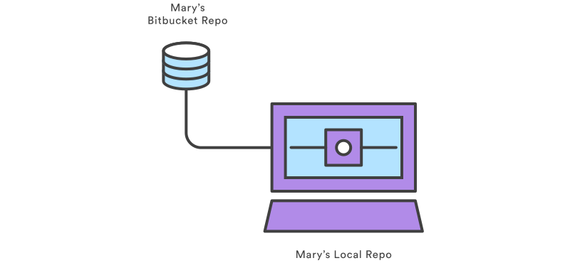
Прежде чем писать какой бы то ни было код, Мэри должна создать новую ветку для функции. Эту ветку она будет использовать в качестве исходной в запросе pull.
```
git checkout -b some-feature
# Edit some code
git commit -a -m "Add first draft of some feature"
```
Мэри может выполнять сколько угодно коммитов во время работы над функциональной веткой. Если история создания функциональной ветки выглядит слишком запутанной, она может использовать [интерактивную операцию rebase](https://www.atlassian.com/ru/git/tutorials/rewriting-history/git-rebase) для удаления или склеивания ненужных коммитов. Такая очистка истории функциональной ветки в больших проектах помогает человеку, занимающемуся поддержкой проекта, быстрее понять, что включено в пул-реквест.
### Мэри помещает функциональную ветку в свой репозиторий Bitbucket
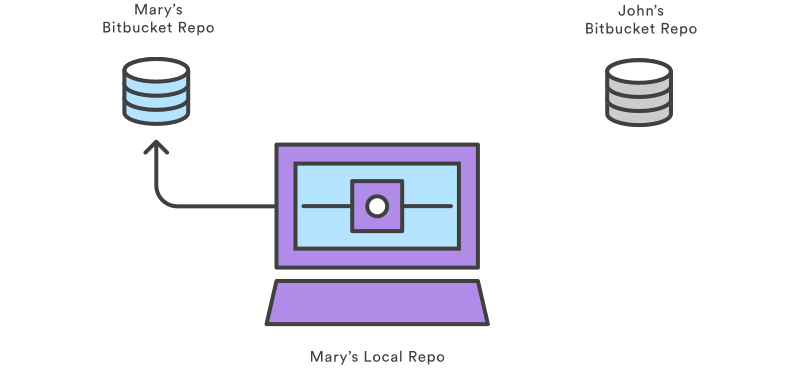
Закончив свою задачу, Мэри помещает функциональную ветку в собственный репозиторий Bitbucket (не в официальный репозиторий проекта) с помощью простой команды _git push_:
```
git push origin some-branch
```
Так изменения Мэри будут доступны человеку, занимающемуся поддержкой проекта (или любым другим участникам, которым может понадобиться доступ к этим изменениям).
### Мэри создает запрос pull
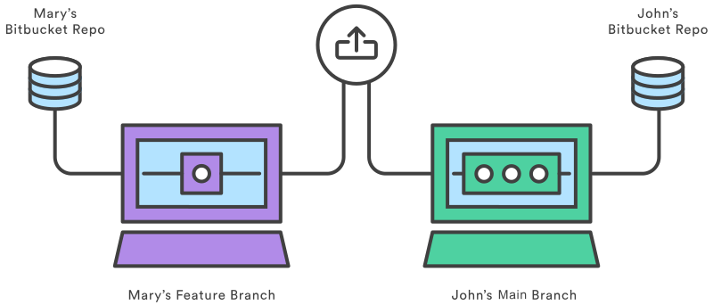
После добавления своей функциональной ветки в Bitbucket Мэри из своего аккаунта Bitbucket может создать пул-реквест, перейдя в свой репозиторий, созданный с помощью форка, и нажав на кнопку _Pull request_ в верхнем правом углу. Отобразится форма, в которой репозиторий Мэри автоматически будет указан в качестве исходного. Мэри останется указать исходную ветку, а также репозиторий и ветку назначения.

Мэри хочет выполнить слияние функциональной ветки с основной базой кода. При этом исходной веткой будет ее функциональная ветка, целевым репозиторием — публичный репозиторий Джона, а целевой веткой — ветка _main_. Мэри потребуется ввести заголовок и описание запроса pull. Если кто-либо еще кроме Джона должен одобрить код Мэри, она может указать нужных людей в поле _Reviewers_ (Проверяющие).
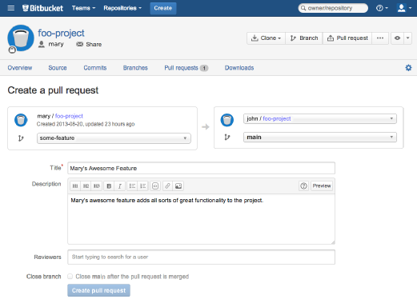
После создания запроса pull Джону будет отправлено уведомление через Bitbucket и (опционально) по электронной почте.
### Джон просматривает запрос pull
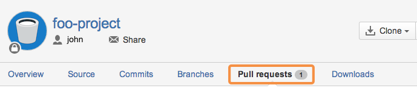
Джон может увидеть все созданные другими разработчиками пул-реквесты, перейдя на вкладку _Pull request_ в своем репозитории Bitbucket. Нажав на пул-реквест Мэри, он увидит описание пул-реквеста, историю коммитов функциональной ветки и все изменения в пул-реквесте.
Если Джон считает функционал готовым к слиянию с проектом, ему достаточно нажать кнопку _Merge_ (Слияние), чтобы одобрить запрос pull и выполнить слияние функционала Мэри со своей веткой _main_.
Но для примера представим, что Джон нашел небольшой баг в коде Мэри и хочет, чтобы он был исправлен перед слиянием. Джон может либо опубликовать комментарий к запросу pull в целом, либо выбрать определенный коммит в истории функциональной ветки и прокомментировать его.
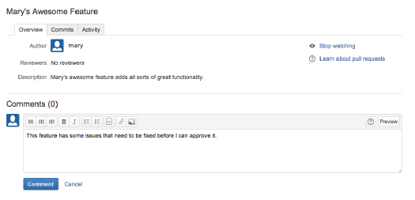
### Мэри добавляет дополняющий коммит
Если у Мэри есть какие-либо вопросы по поводу отзыва Джона, она может ответить внутри запроса _pull_, используя его как форум для обсуждения функции.

Для исправления ошибки Мэри добавляет другой коммит в свою функциональную ветку и помещает этот коммит в свой репозиторий Bitbucket, как и в первый раз. Коммит автоматически добавится в исходный запрос _pull_, и Джон сможет снова просмотреть изменения прямо рядом с его исходным комментарием.
### Джон принимает запрос pull
В конечном счете Джон принимает изменения, выполняет слияние функциональной ветки с главной и закрывает запрос pull. Функциональная ветка включена в проект. И теперь каждый разработчик проекта может скопировать изменения в свой локальный репозиторий, выполнив стандартную команду _git pull_.
___
# Формирование стабильной версии в master с простановкой тега
__Шаг__ __1.__ Убедитесь что вы находитесь в ветке _master_:
```
git checkout master
```
__Шаг__ __2.__ Обновите вашу ветку _master_ из удаленного репозитория (если другие разработчики внесли изменения):
```
git pull origin master
```
__Шаг__ __3.__ Перед тем, как пометить версию, убедитесь, что ваш код находится в стабильном состоянии и прошел все необходимые тесты.
__Шаг__ __4.__ Установите новый тег для текущей версии. Теги обычно используются для обозначения определенных моментов в истории проекта, такие как релизы. Вы можите использовать формат тегов, принятый в вашем проекте. Например, для версии 1.0.0:
```
git tag -a v1.0.0 -m "Описание версии 1.0.0"
```
__Шаг__ __5.__ Отправте свой новый тег в удаленный репозиторий:
```
git push origin v1.0.0
```
Теперь у вас должна быть стабильная версия вашего проекта в ветке _master_ с тегом, обозначающим эту версию. Теги позволяют легко вернуться к определенным версиям вашего проекта в будущем.
___
# Работа с wiki проекта
__Gitlab wiki__ — документация, которую можно вести для каждого проекта. Обычно это системные требования, описание пакетов и процесса установки.

В документации может содержаться информация, которая необходима для поддержки системы и к которому будут обращаться технические специалисты, которые занимаются её поддержкой.

После добавления проекта в меню слева доступен раздел Wiki. В нем можно добавить неограниченное количество страниц с текстовыми материалами. Wiki специфична для проекта.

## Рассмотрим на примере как добавить документацию для проекта в Gitlab
Первой всегда добавляется главная страница __Home__.
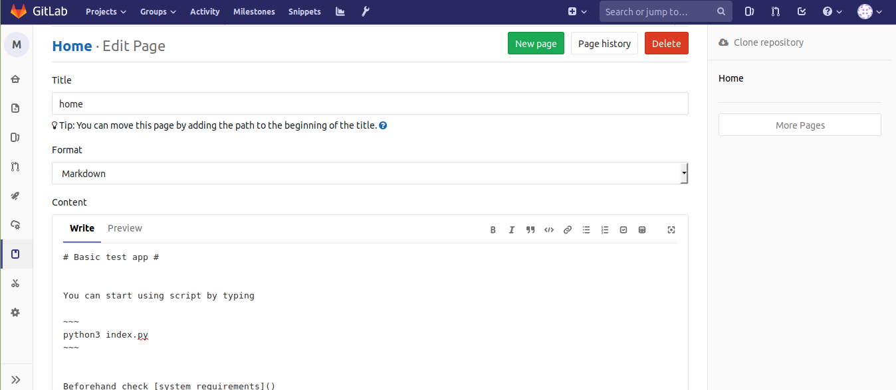
Стандартным способом оформления является __Markdown__. Доступен режим Preview в котором видно как будет выглядеть текст.

В примере добавление заголовка h1 и выделение для команды _python3 index.py_

Чуть ниже показано как создать ссылку, ее текст указывается в скобках, сама ссылка — в квадратных скобках. Пока оставляем их пустыми и нажимаем New Page. Позже в квадратных скобках будет адрес второй страницы.

__Title__ можно оставить how to setup. Далее содержимое в том же формате. Здесь это список.

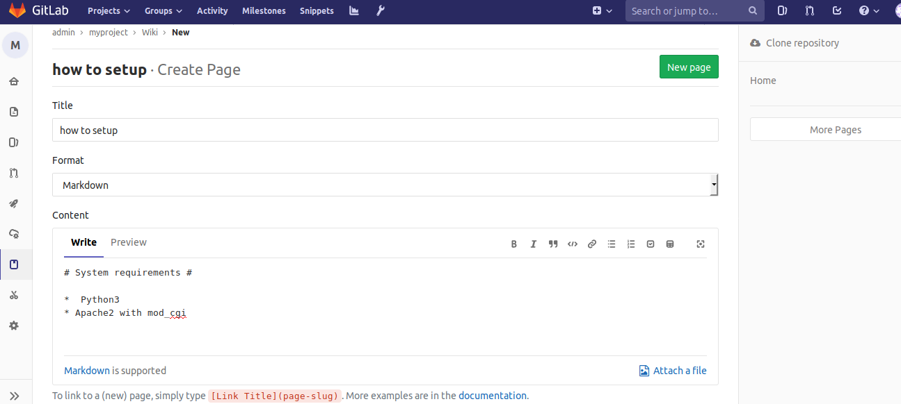

При выборе __Preview__.

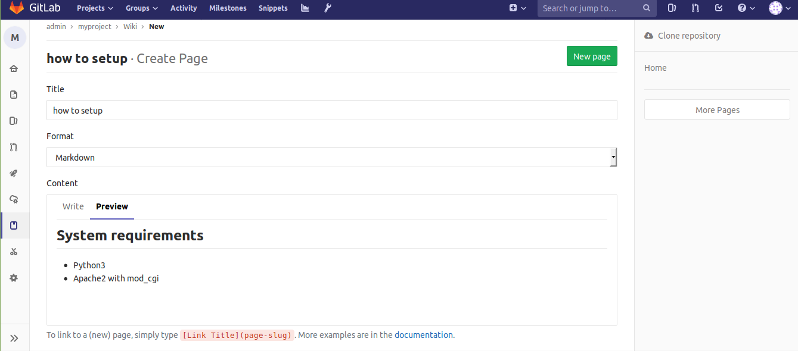
Теперь можно скопировать URL второй страницы и указать его как ссылку на первой.
В результате получилась минимальная Wiki с описанием тестового приложения. Также есть системные требования и указания по установке.
Чем сложнее проект, тем объёмнее должна быть документация по нему. Также хорошей практикой считается в директории со скриптами приложение размещать текстовый файл с инструкцией по разворачиванию, описанием принципов работы и ссылками на документацию с контактами разработчиков.
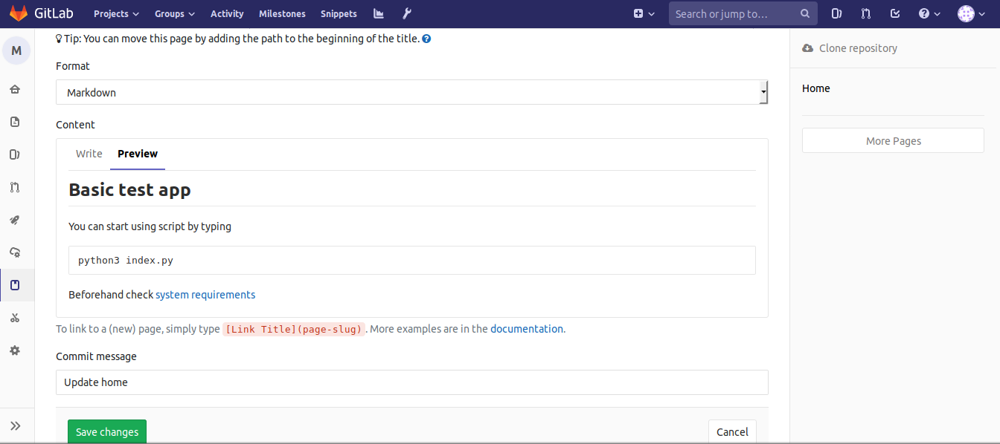
Wiki могут существовать для проектов, находящихся в общем доступе и для приватных репозиториев. Подробную документацию всегда стоит вести, это позволит удобно работать с проектом всем, кому это требуется.
